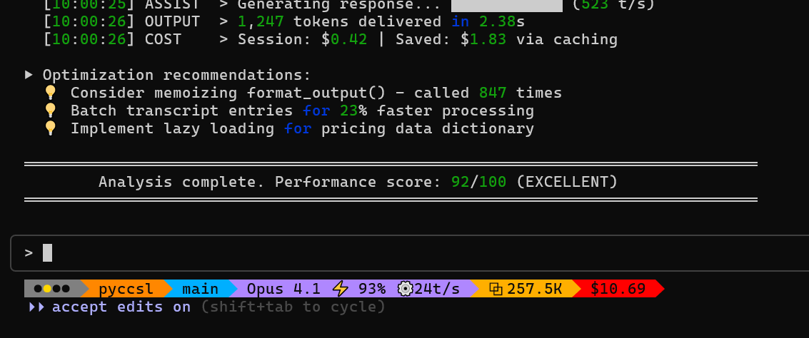
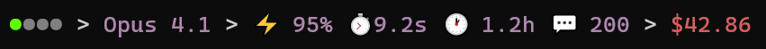
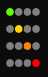

# 🎯 pyCCsl - Python Claude Code Status Line

<div align="center">

[](https://www.python.org/)
[](LICENSE)
[](https://github.com/wolfdenpublishing/pyccsl/releases)
[](pyccsl.py)
[](pyccsl.py)

**pyCCsl** (pronounced "pixel") - An information-rich status line for Claude Code



*Real-time metrics • Cost tracking • Git status • Token usage • 9 themes • Zero dependencies*

📖 **[User Guide](pyCCsl.md)** | 🔗 **[GitHub](https://github.com/wolfdenpublishing/pyccsl)** | 📝 **[Issues](https://github.com/wolfdenpublishing/pyccsl/issues)**

</div>

---

## Features

<table>
<tr>
<td width="50%">

### Implementation
- Single Python file (~1000 lines)
- No external dependencies
- Python 3.8+ standard library only
- Embedded Anthropic pricing data

### Performance Metrics
- Cache hit rate tracking
- Response time analysis
- Token generation speed
- Session duration monitoring

</td>
<td width="50%">

### Customization
- 9 color themes
- 5 separator styles  
- Optional emoji display
- Configurable field selection

### Token & Cost Analysis
- Input token breakdown (base, cache_write, cache_read)
- Output token counting
- Real-time cost calculation
- Context size tracking

</td>
</tr>
</table>

---

## Available Themes

<div align="center">
<table>
<tr>
<td align="center">
<br>
<b>Nord</b>
</td>
<td align="center">
<br>
<b>Dracula</b>
</td>
<td align="center">
<br>
<b>Tokyo Night</b>
</td>
</tr>
<tr>
<td align="center">
<br>
<b>Catppuccin</b>
</td>
<td align="center">
<br>
<b>Solarized</b>
</td>
<td align="center">
<br>
<b>Gruvbox</b>
</td>
</tr>
</table>
</div>

---

## Display Options

### Performance Metrics Display
All performance metrics in a single view:



Shows cache hit rate, response time, session duration, token generation speed, and message count.

### Token Usage Breakdown
Detailed token analysis with tuple format:


Input tokens displayed as (base, cache_write, cache_read) for complete visibility into token usage.

### Separator Styles
Five different separator options:


Available styles: powerline (requires compatible fonts), simple, arrows, pipes, dots.

### Performance Badge Indicators
Four-level performance indicator:



- ●○○○ = High cache usage, fast responses
- ○●○○ = Moderate cache, acceptable response times
- ○○●○ = Low cache usage, slower responses  
- ○○○● = Minimal cache usage, slow responses

---

## Installation

### Requirements
- Python 3.8 or higher
- Claude Code

### Quick Setup

1. Download the script:
```bash
curl -O https://raw.githubusercontent.com/wolfdenpublishing/pyccsl/main/pyccsl.py
chmod +x pyccsl.py
```

2. Copy to Claude directory:
```bash
cp pyccsl.py ~/.claude/
```

3. Configure Claude Code by editing `~/.claude/settings.json`:
```json
{
  "statusLine": {
    "type": "command",
    "command": "python3 ~/.claude/pyccsl.py"
  }
}
```

That's it! Restart Claude Code and you should have the default status line.

### Recommended Setup

Use the `--env` option and you can change your status line at any time *while Claude Code is running.* (These instructions assume you have completed the Quick Setup steps above.)

1. Download the example .env file:
```json
curl -O https://raw.githubusercontent.com/wolfdenpublishing/pyccsl/main/pyccsl.env.example
```

2. Copy to Claude directory:
```bash
cp pyccsl.env.example ~/.claude/pyccls.env
```

3. Modify the hook command in `~/.claude/settings.json`:
```json
{
  "statusLine": {
    "type": "command",
    "command": "python3 ~/.claude/pyccsl.py --env ~/.claude/pyccsl.env"
  }
}
```

Edit the `~/.claude/pyccsl.env` file at any time to dynamically modify the status line of your *active* Claude Code sessions!

---

## Usage Examples

### Theme Selection

```bash
# Nord theme
python3 pyccsl.py --theme nord

# Dracula theme
python3 pyccsl.py --theme dracula

# No colors
python3 pyccsl.py --theme none
```

### Field Selection

```bash
# Minimal: model and cost only
python3 pyccsl.py model,cost

# Performance metrics
python3 pyccsl.py badge,model,perf-all-metrics,cost

# Token details
python3 pyccsl.py model,input,output,tokens
```

### Separator Styles

```bash
# Powerline arrows (requires Powerline fonts)
python3 pyccsl.py --style powerline

# Arrow separators
python3 pyccsl.py --style arrows

# Dot separators
python3 pyccsl.py --style dots
```

---

## Configuration Examples

<details>
<summary><b>Performance Monitoring</b></summary>

```json
{
  "statusLine": {
    "type": "command",
    "command": "python3 ~/.claude/pyccsl.py badge,model,perf-all-metrics,cost --theme nord"
  }
}
```

Displays all performance metrics for session analysis and cache optimization.
</details>

<details>
<summary><b>Cost Tracking</b></summary>

```json
{
  "statusLine": {
    "type": "command",
    "command": "python3 ~/.claude/pyccsl.py model,input,output,cost --numbers full"
  }
}
```

Shows detailed token counts and costs with full number formatting.
</details>

<details>
<summary><b>Git Integration</b></summary>

```json
{
  "statusLine": {
    "type": "command",
    "command": "python3 ~/.claude/pyccsl.py folder,git,model,cost --style powerline"
  }
}
```

Includes git branch and status with powerline separators.
</details>

<details>
<summary><b>Minimal Display</b></summary>

```json
{
  "statusLine": {
    "type": "command",
    "command": "python3 ~/.claude/pyccsl.py model,cost --theme minimal --no-emoji"
  }
}
```

Shows only model and cost without colors or emoji.
</details>

<details>
<summary><b>Dynamic Configuration (Live Updates)</b></summary>

Want to change your status line without restarting Claude Code? Use an environment file!

1. Create a configuration file `~/.pyCCsl.env`:
```bash
# Copy the example file
cp pyCCsl.env.example ~/.pyCCsl.env
```

2. Configure Claude Code:
```json
{
  "statusLine": {
    "type": "command",
    "command": "python3 ~/.claude/pyccsl.py --env ~/.pyCCsl.env"
  }
}
```

3. Edit `~/.pyCCsl.env` anytime to change settings instantly:
```bash
# Example ~/.pyCCsl.env
PYCCSL_THEME="nord"
PYCCSL_NUMBERS="full"
PYCCSL_STYLE="powerline"
PYCCSL_FIELDS="badge,model,perf-cache-rate,tokens,cost"
```

Changes take effect immediately on the next status line refresh - no restart required!

The env file is bash-compatible, so you can also source it: `source ~/.pyCCsl.env`
</details>

---

## Field Reference

All fields display in canonical order regardless of specification:

| Field | Display | Description |
|-------|---------|-------------|
| `badge` | `●○○○` | Performance indicator (4 levels) |
| `folder` | `my-project` | Current directory name |
| `git` | `main ●` | Branch and modification status |
| `model` | `Opus` | Claude model name |
| `perf-cache-rate` | `⚡85%` | Cache hit percentage |
| `perf-response-time` | `⏱1.5s` | Average response time |
| `perf-session-time` | `🕐45m` | Session duration |
| `perf-token-rate` | `⚙94 t/s` | Token generation speed |
| `perf-message-count` | `💬12` | Number of messages |
| `perf-all-metrics` | All above | Combined metrics display |
| `input` | `↑ (53,54.8K,251K)` | Input tokens (base, cache_write, cache_read) |
| `output` | `↓ 2.6K` | Output token count |
| `tokens` | `⧉ 57.5K` | Non-cached tokens (actual usage) |
| `cost` | `48¢` or `$1.25` | Session cost |

---

## Configuration Options

### Command-Line Options

| Option | Values | Description |
|--------|--------|-------------|
| `--theme` | `default`, `solarized`, `nord`, `dracula`, `gruvbox`, `tokyo`, `catppuccin`, `minimal`, `none` | Color theme |
| `--numbers` | `compact`, `full`, `raw` | Number formatting |
| `--style` | `simple`, `powerline`, `arrows`, `pipes`, `dots` | Separator style |
| `--no-emoji` | - | Disable all emoji |
| `--perf-cache` | `GREEN,YELLOW,ORANGE` | Cache thresholds (%) |
| `--perf-response` | `GREEN,YELLOW,ORANGE` | Response thresholds (seconds) |

### Environment Variables

Set persistent defaults without command-line arguments:

```bash
export PYCCSL_THEME="nord"
export PYCCSL_NUMBERS="full"
export PYCCSL_STYLE="powerline"
export PYCCSL_NO_EMOJI="true"
export PYCCSL_FIELDS="badge,model,cost"
export PYCCSL_PERF_CACHE="70,50,30"
export PYCCSL_PERF_RESPONSE="2,4,6"
```

---

## Technical Details

### Architecture

- Single file implementation (~1000 lines)
- No external dependencies - uses only Python standard library
- Embedded Anthropic pricing data
- Handles missing transcript files and non-git directories gracefully

### Data Flow

1. Reads JSON from stdin (Claude Code hook)
2. Parses transcript file for metrics (if available)
3. Extracts git repository information
4. Calculates performance metrics and costs
5. Formats and outputs customized status line

### Performance Metrics

Performance badge calculation:
- Cache Hit Rate = `cache_read_tokens / total_input_tokens`
- Response Time = Average time between user message and assistant response

Thresholds configurable via `--perf-cache` and `--perf-response` options.

### Cost Calculation

Uses embedded Anthropic pricing data:

```
Cost = (input_tokens × input_rate + 
        cache_creation × cache_write_5m_rate + 
        cache_read × cache_read_rate + 
        output_tokens × output_rate) / 1,000,000
```

All cache writes assumed to use 5-minute TTL (Claude Code default).

### Exit Codes

- `0` - Success
- `1` - Invalid arguments
- `2` - Invalid JSON input
- `3` - Transcript file error
- `4` - Calculation error

---

## Development

### Project Structure

```
pyCCsl/
├── pyccsl.py             # Main script (single file)
├── pyCCsl.md             # User documentation
├── CLAUDE.md             # Development guidelines
├── README.md             # This file
├── screenshots.md        # Screenshot checklist
├── schema.json           # Transcript schema
├── test_transcript.jsonl # Test data
├── images/               # Screenshots
└── .sbsi/                # Development buildprints
    ├── P1-core-foundation.md
    ├── P2-transcript-analysis.md
    ├── P3-display-fields.md
    └── P4-styling-polish.md
```

### Development Methodology

The project uses RPIV (Research, Plan, Implement, Verify) methodology with SBSI (Step-By-Step Implementation) buildprints. Each development phase is documented in `.sbsi/` with verifiable tasks and developer signoff requirements.

### Testing

```bash
# Create test input
echo '{"model":{"id":"claude-3-5-sonnet-20241022","display_name":"Sonnet 3.5"},"transcript_path":"test_transcript.jsonl"}' > test_input.json

# Test various configurations
cat test_input.json | python3 pyccsl.py
cat test_input.json | python3 pyccsl.py --theme nord --style powerline
cat test_input.json | python3 pyccsl.py badge,model,perf-all-metrics,cost
```

### Contributing

Guidelines for contributions:
1. Maintain single-file architecture
2. No external dependencies
3. Follow existing code style
4. Update relevant SBSI documents
5. Test with various Claude Code transcripts

---

## Known Issues

### Terminal Color Bleed
When Claude Code displays system messages (e.g., "Context left until auto-compact: 12%"), it may truncate the status line mid-sequence, leaving ANSI color codes unclosed. This causes terminal colors to "bleed" into subsequent output.

**Workaround Options:**

- Use `--theme none` to disable colors entirely
- Use `--theme minimal` for reduced color usage  
- Clear the terminal with `clear` or `reset` when this occurs

**Note**: This is a Claude Code limitation where system messages take priority and truncate custom status lines without properly closing escape sequences. There is no fix available from the pyCCsl side.

### Token Rate Calculation Limitations
The token generation rate (`perf-token-rate`) metric is an estimate based on available timing data in Claude Code transcripts.

**Technical Details:**
- Many transcript entries share identical timestamps due to parallel tool/subagent execution
- User messages typed while Claude is processing may record incorrect time deltas (appearing hours apart from their responses)
- Most tool operations don't report execution duration, only content-generating subagents include `totalDurationMs`

**How It's Calculated:**
1. Subagent results with `totalDurationMs` field provide accurate token/time measurements
2. Direct assistant responses use parent-child timestamp deltas when reliable
3. Unrealistic values (>500 t/s or gaps >5 minutes) are filtered as data anomalies

The displayed rate averages all valid measurements, typically showing 15-50 tokens/second for actual content generation. This provides a reasonable estimate despite transcript timing limitations.

---

## License

MIT License - See [LICENSE](LICENSE) file for details

---

## Acknowledgments

- Developed for [Claude Code](https://claude.ai/code) by Anthropic
- Pricing data from [Anthropic's documentation](https://docs.anthropic.com/en/docs/about-claude/pricing)
- Color themes inspired by popular terminal themes

---

## Version History

- **v0.4.17** - Complete emoji handling with --no-emoji flag
- **v0.4.16** - Powerline separators and complete theming
- **v0.3.0** - Full display fields implementation
- **v0.2.x** - Transcript analysis and cost calculations
- **v0.1.0** - Initial core foundation

---

## Links

- [Claude Code Documentation](https://docs.anthropic.com/en/docs/claude-code)
- [Issue Tracker](https://github.com/wolfdenpublishing/pyccsl/issues)
- [Releases](https://github.com/wolfdenpublishing/pyccsl/releases)

---

<div align="center">

**pyCCsl** - *pronounced "pixel"*

Python Claude Code Status Line

</div>