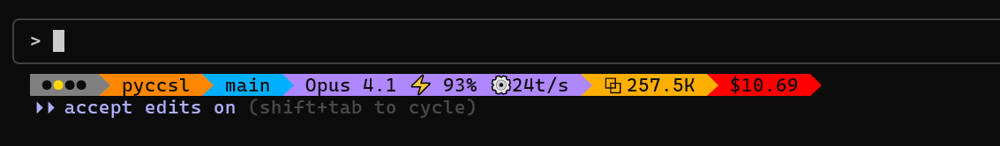

# 🎯 pyCCsl - Python Claude Code Status Line

<div align="center">

[](https://www.python.org/)
[](LICENSE)
[](https://github.com/wolfdenpublishing/pyccsl/releases)
[](pyccsl.py)
[](pyccsl.py)

**pyCCsl** (pronounced "pixel") - An information-rich status line for Claude Code



*Real-time metrics • Cost tracking • Git status • Token usage • 9 themes • Zero dependencies*

📖 **[User Guide](pyccsl.md)** | 🔗 **[GitHub](https://github.com/wolfdenpublishing/pyccsl)** | 📝 **[Issues](https://github.com/wolfdenpublishing/pyccsl/issues)**

</div>

---

## Features

<table>
<tr>
<td width="50%">

### Implementation
- Single Python file (~1000 lines)
- No external dependencies
- Python 3.8+ standard library only
- Embedded Anthropic pricing data

### Performance Metrics
- Cache hit rate tracking
- Response time analysis
- Token generation speed
- Session duration monitoring

</td>
<td width="50%">

### Customization
- 9 color themes
- 5 separator styles  
- Optional emoji display
- Configurable field selection

### Token & Cost Analysis
- Input token breakdown (base, cache_write, cache_read)
- Output token counting
- Real-time cost calculation
- Context size tracking

</td>
</tr>
</table>

---

## Selected  Themes

<div align="center">
<table>
<tr>
<td align="center">
<br>
<b>Default</b>
</td>
<td align="center">
<br>
<b>Dracula</b>
</td>
<td align="center">
<br>
<b>Nord</b>
</td>
</tr>
<tr>
<td align="center">
<br>
<b>Catppuccin</b>
</td>
<td align="center">
<br>
<b>Tokyo Night</b>
</td>
<td align="center">
<br>
<b>Minimal</b>
</td>
</tr>
</table>
</div>


---

## Display Options

### Performance Metrics Display
All performance metrics in a single view:


Shows cache hit rate, response time, session duration, token generation speed, and message count.

### Token Usage Breakdown
Detailed token analysis with tuple format:


Input tokens displayed as (base, cache_write, cache_read) for complete visibility into token usage.

### Separator Styles
Five different separator options:


Available styles: powerline (requires compatible fonts), simple, arrows, pipes, dots.

### Performance Badge Indicators
Four-level performance indicator:


- ●○○○ = High cache usage, fast responses
- ○●○○ = Moderate cache, acceptable response times
- ○○●○ = Low cache usage, slower responses  
- ○○○● = Minimal cache usage, slow responses

---

## Installation

### Requirements
- Python 3.8 or higher
- Claude Code

### Quick Setup

1. Download the script:
```bash
curl -O https://raw.githubusercontent.com/wolfdenpublishing/pyccsl/main/pyccsl.py
chmod +x pyccsl.py
```

2. Copy to Claude directory:
```bash
cp pyccsl.py ~/.claude/
```

3. Configure Claude Code by editing `~/.claude/settings.json`:
```json
{
  "statusLine": {
    "type": "command",
    "command": "python3 ~/.claude/pyccsl.py"
  }
}
```

That's it! Restart Claude Code and you should have the default status line.

### Recommended Setup

Use the `--env` option and you can change your status line at any time *while Claude Code is running.* (These instructions assume you have completed the Quick Setup steps above.)

1. Download the example .env file:
```bash
curl -O https://raw.githubusercontent.com/wolfdenpublishing/pyccsl/main/pyccsl.env.example
```

2. Copy to Claude directory:
```bash
cp pyccsl.env.example ~/.claude/pyccsl.env
```

3. Modify the hook command in `~/.claude/settings.json`:
```json
{
  "statusLine": {
    "type": "command",
    "command": "python3 ~/.claude/pyccsl.py --env ~/.claude/pyccsl.env"
  }
}
```

Edit the `~/.claude/pyccsl.env` file at any time to dynamically modify the status line of your *active* Claude Code sessions!

### Powerline Fonts (Optional)

The `--style powerline` option creates beautiful arrow separators, but requires Powerline-compatible fonts to display correctly.

<details>
<summary><b>Installing Powerline Fonts</b></summary>

#### macOS
```bash
# Using Homebrew
brew tap homebrew/cask-fonts
brew install --cask font-meslo-lg-nerd-font

# Or download directly
git clone https://github.com/powerline/fonts.git --depth=1
cd fonts
./install.sh
cd ..
rm -rf fonts
```

#### Linux
```bash
# Ubuntu/Debian
sudo apt-get install fonts-powerline

# Or manually install
git clone https://github.com/powerline/fonts.git --depth=1
cd fonts
./install.sh
cd ..
rm -rf fonts
```

#### Windows
```powershell
# Using Scoop
scoop bucket add nerd-fonts
scoop install Meslo-NF

# Or manually:
# 1. Download fonts from https://github.com/powerline/fonts
# 2. Right-click on .ttf files and select "Install"
```

#### Terminal Configuration
After installing, configure your terminal to use a Powerline font:
- **VS Code Terminal**: Settings → Terminal → Font Family → "MesloLGS NF" or "DejaVu Sans Mono for Powerline"
- **iTerm2 (macOS)**: Preferences → Profiles → Text → Font → Select a Powerline font
- **Windows Terminal**: Settings → Profiles → Font face → Select a Powerline font
- **Linux Terminal**: Edit → Preferences → Custom font → Select a Powerline font

**Note**: If Powerline fonts aren't installed or configured, the arrows will appear as boxes (□) or question marks. Use `--style simple` (default) or other styles if you prefer not to install special fonts.

</details>

---

## Configuration Examples

<details>
<summary><b>Performance Monitoring</b></summary>

```json
{
  "statusLine": {
    "type": "command",
    "command": "python3 ~/.claude/pyccsl.py badge,model,perf-all-metrics,cost --theme nord"
  }
}
```

Displays all performance metrics for session analysis and cache optimization.
</details>

<details>
<summary><b>Cost Tracking</b></summary>

```json
{
  "statusLine": {
    "type": "command",
    "command": "python3 ~/.claude/pyccsl.py model,input,output,cost --numbers full"
  }
}
```

Shows detailed token counts and costs with full number formatting.
</details>

<details>
<summary><b>Minimal Display</b></summary>

```json
{
  "statusLine": {
    "type": "command",
    "command": "python3 ~/.claude/pyccsl.py model,cost --theme minimal --no-emoji"
  }
}
```

Shows only model and cost without colors or emoji.
</details>

<details>
<summary><b>Dynamic Configuration (Live Updates)</b></summary>

Want to change your status line without restarting Claude Code? Use an environment file!

1. Create a configuration file `~/.pyCCsl.env`:
```bash
# Copy the example file
cp pyCCsl.env.example ~/.pyCCsl.env
```

2. Configure Claude Code:
```json
{
  "statusLine": {
    "type": "command",
    "command": "python3 ~/.claude/pyccsl.py --env ~/.pyCCsl.env"
  }
}
```

3. Edit `~/.pyCCsl.env` anytime to change settings instantly:
```bash
# Example ~/.pyCCsl.env
PYCCSL_THEME="nord"
PYCCSL_NUMBERS="full"
PYCCSL_STYLE="powerline"
PYCCSL_FIELDS="badge,model,perf-cache-rate,tokens,cost"
```

Changes take effect immediately on the next status line refresh - no restart required!

The env file is bash-compatible, so you can also source it: `source ~/.pyCCsl.env`
</details>

---

## Technical Details

### Architecture

- Single file implementation (~1000 lines)
- No external dependencies - uses only Python standard library
- Embedded Anthropic pricing data
- Handles missing transcript files and non-git directories gracefully

### Data Flow

1. Reads JSON from stdin (Claude Code hook)
2. Parses transcript file for metrics (if available)
3. Extracts git repository information
4. Calculates performance metrics and costs
5. Formats and outputs customized status line

### Performance Metrics

Performance badge calculation:
- Cache Hit Rate = `cache_read_tokens / total_input_tokens`
- Response Time = Average time between user message and assistant response

Thresholds configurable via `--perf-cache` and `--perf-response` options.

### Cost Calculation

Uses embedded Anthropic pricing data:

```
Cost = (input_tokens × input_rate + 
        cache_creation × cache_write_5m_rate + 
        cache_read × cache_read_rate + 
        output_tokens × output_rate) / 1,000,000
```

All cache writes assumed to use 5-minute TTL (Claude Code default).

### Exit Codes

- `0` - Success
- `1` - Invalid arguments
- `2` - Invalid JSON input
- `3` - Transcript file error
- `4` - Calculation error

---

## Known Issues

### Terminal Color Bleed
When Claude Code displays system messages (e.g., "Context left until auto-compact: 12%"), it may truncate the status line mid-sequence, leaving ANSI color codes unclosed. This causes terminal colors to "bleed" into subsequent output.

**Workaround Options:**

- Use `--theme none` to disable colors entirely
- Use `--theme minimal` for reduced color usage  
- Clear the terminal with `clear` or `reset` when this occurs

**Note**: This is a Claude Code limitation where system messages take priority and truncate custom status lines without properly closing escape sequences. There is no fix available from the pyCCsl side.

---

## License

MIT License - See [LICENSE](LICENSE) file for details

---

## Acknowledgments

- Developed for [Claude Code](https://claude.ai/code) by Anthropic
- Pricing data from [Anthropic's documentation](https://docs.anthropic.com/en/docs/about-claude/pricing)
- Color themes inspired by popular terminal themes

---

## Links

- [Claude Code Documentation](https://docs.anthropic.com/en/docs/claude-code)
- [Issue Tracker](https://github.com/wolfdenpublishing/pyccsl/issues)
- [Releases](https://github.com/wolfdenpublishing/pyccsl/releases)

---

<div align="center">
**pyCCsl** - *pronounced "pixel"* - Made with ❤️ for the Claude Code Community
</div>
